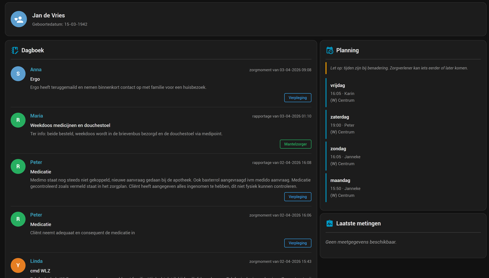

# eCare Dossier Monitor

[](https://github.com/hacs/integration)


Home Assistant integratie die het eCare zorgdossier (Puur van Jou / wijkzorg) monitort.
Vuurt een HA event bij nieuwe dagboek-items, toont komende zorgbezoeken in de kalender
en houdt metingen bij.

> **Let op:** Ik heb zelf alleen toegng tot het **Puur van Jou** portaal (`wijkzorg.puurvanjou.nl`) en dus alleen daarmee getest.
> De API is niet officieel gedocumenteerd en kan zonder aankondiging wijzigen.

## Getest met

| Zorgorganisatie | Type | Status |
|----------------|------|--------|
| [BrabantZorg](https://www.brabantzorg.eu) | Thuiszorg | ✅ Werkend |

## Achtergrond

[eCare.nl](https://ecare.nl) is een zorgdossier platform voor Nederlandse wijkzorgorganisaties.
Via [wijkzorg.puurvanjou.nl](https://wijkzorg.puurvanjou.nl) kunnen familieleden het dossier inzien.
Deze integratie pollt de achterliggende API en maakt alle relevante data beschikbaar in Home Assistant.

## Installatie via HACS

Klik op de knop om de repository direct toe te voegen:

[](https://my.home-assistant.io/redirect/hacs_repository/?owner=rweijnen&repository=ecare-ha&category=integration)

Of handmatig:
1. Ga naar HACS → Integraties → ⋮ → **Aangepaste opslagplaatsen**
2. Voeg toe: `https://github.com/rweijnen/ecare-ha` als type **Integratie**
3. Zoek op "eCare" en installeer
4. Herstart Home Assistant

## Handmatige installatie

Kopieer de map `custom_components/ecare/` naar `<config>/custom_components/ecare/` en herstart HA.

## Configuratie

Ga naar **Instellingen → Integraties → + Toevoegen → eCare Dossier Monitor**

### Stap 1 — Inloggegevens
Voer je e-mailadres en wachtwoord in van je Puur van Jou account.

### Stap 2 — SMS verificatie
Je ontvangt een SMS van **+31 970 10 20 50 53**. Voer de code in.

Na de eerste keer inloggen wordt de sessie opgeslagen. Toekomstige token-vernieuwingen
verlopen automatisch **zonder SMS** zolang de IDP-sessie geldig is (typisch weken tot maanden).
Als de sessie verloopt, vraagt HA je opnieuw te configureren via **Instellingen → Integraties → eCare → Opnieuw configureren**.

## Entities

### Sensoren

| Entity | Beschrijving |
|--------|-------------|
| `sensor.ecare_dagboek_items` | Totaal aantal items in het dagboek |
| `sensor.ecare_laatste_gebeurtenis` | Meest recente dagboek-item (type, wie, tekst) |
| `sensor.ecare_eerstvolgende_bezoek` | Eerstvolgende geplande zorgbezoek (datum, tijd, zorgverlener) |
| `sensor.ecare_client` | Naam en geboortedatum van de cliënt |
| `sensor.ecare_gewicht` | Laatste gewichtsmeting |
| `sensor.ecare_bloeddruk` | Laatste bloeddruk (systolisch/diastolisch) |
| `sensor.ecare_hartslag` | Laatste hartslagmeting |
| `sensor.ecare_temperatuur` | Laatste temperatuurmeting |
| `sensor.ecare_glucose` | Laatste glucosemeting |
| `sensor.ecare_pijnscore` | Laatste pijnscoresmeting |

### Kalender

| Entity | Beschrijving |
|--------|-------------|
| `calendar.ecare_planning` | Komende zorgbezoeken zichtbaar in de HA kalender |

De kalender toont bezoeken uit de planning. Verlopen bezoeken (meer dan 2 uur na het geplande
tijdstip) worden automatisch verborgen. Tijden zijn bij benadering — zorgverleners kunnen
vroeger of later komen.

## Events

Bij elk nieuw dagboek-item wordt het event `ecare_new_item` gevuurd:

| Attribuut | Voorbeeld |
|-----------|-----------|
| `id` | `14f2b911-b556-4d82-...` |
| `type` | `rapportage` of `zorgmoment` |
| `datum` | `02-04-2026` |
| `tijd` | `10:36` |
| `wie` | `Merel` |
| `discipline` | `Verpleging` |
| `onderwerp` | `Medicatie` |
| `tekst` | Inhoud (max 500 tekens, HTML gestript) |

## Voorbeeld Dashboard

Een compleet responsief dashboard is beschikbaar in [`dashboard_voorbeeld.yaml`](dashboard_voorbeeld.yaml).



**Vereist (HACS frontend):**
- [Layout Card](https://github.com/thomasloven/lovelace-layout-card)
- [HTML Jinja2 Template Card](https://github.com/PiotrMachowski/Home-Assistant-Lovelace-HTML-Jinja2-Template-card)

**Installatie:**
1. Ga naar **Instellingen → Dashboards → Dashboard toevoegen → Vanaf nul**
2. Klik rechtsboven op **⋮ → Raw configuratie-editor**
3. Plak de inhoud van `dashboard_voorbeeld.yaml`
4. Klik **Opslaan**

## Telegram notificatie

Vereist: [Telegram bot integratie](https://www.home-assistant.io/integrations/telegram/) al geconfigureerd in HA.

```yaml
alias: eCare - Stuur Telegram bij nieuw dagboek-item
trigger:
  - platform: event
    event_type: ecare_new_item
action:
  - service: telegram_bot.send_message
    data:
      message: >
        Nieuw in dossier:

        {{ trigger.event.data.datum }} {{ trigger.event.data.tijd }}
        {{ trigger.event.data.wie }} ({{ trigger.event.data.discipline }})
        {{ trigger.event.data.type }}
        {{ trigger.event.data.onderwerp }}
        
        {{ trigger.event.data.tekst[:400] }}
```

## Poll interval aanpassen

Ga naar **Instellingen → Integraties → eCare → Configureren** (standaard: 15 minuten, min: 5, max: 60).

## Bekende beperkingen

- Werkt alleen voor het **Puur van Jou** portaal (`wijkzorg.puurvanjou.nl`)
- Andere eCare-portalen zijn niet getest
- De API is niet officieel gedocumenteerd en kan wijzigen
- Sessie verloopt na verloop van tijd — opnieuw configureren met SMS vereist

## Technische details

De integratie gebruikt de IdentityServer4 OIDC implicit flow van `pvj-idp.ecare.nl`.
Na de initiële SMS-verificatie worden de sessiecookies opgeslagen en wordt `prompt=none`
gebruikt voor stille token-vernieuwing.

## Bijdragen

Issues en pull requests zijn welkom.

## Disclaimer

Deze integratie is niet gelieerd aan of goedgekeurd door eCare.nl of Puur van Jou.
Gebruik is voor eigen risico.
